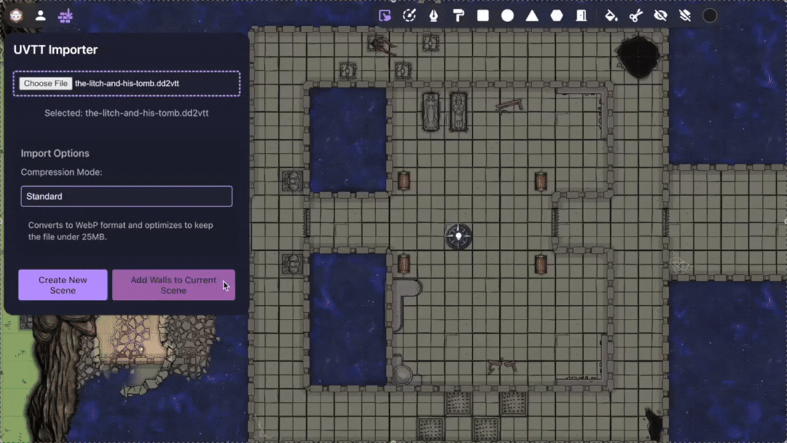

# UVTT Importer

Import walls and doors from Universal VTT (.uvtt), DD2VTT (.dd2vtt), and FoundryVTT scene (.json) files directly for [Dynamic Fog](https://extensions.owlbear.rodeo/dynamic-fog). Perfect for bringing in maps from Dungeondraft, DungeonFog, Foundry VTT, and other VTT map creation tools.

This importer is designed to work with the Dynamic Fog Extension, providing an easy way to import walls and doors from your existing maps. For users seeking advanced features like dynamic lighting and custom fog backgrounds, check out the excellent [Smoke & Spectre Extension](https://extensions.owlbear.rodeo/smoke).

## Import a New Map

This will create an new Scene

1. Open a scene
2. Click the UVTT Importer button in the toolbar
3. Select your file
4. Choose your compression mode (see below)
5. Click "Create New Scene" This can take a moment, depending on the compression.
6. Click "Upload Scene"
7. Wait for the import to complete

### Add Walls and Doors

1. Open the newly created Scene
2. Click the UVTT Importer button in the toolbar
3. Select your file (if not already selected)
4. Click "Add Walls to Current Scene"
5. Done!

## Compression Modes

When importing maps, you can choose from three compression modes:

| Mode     | Description                                           |
| -------- | ----------------------------------------------------- |
| Standard | Best for most maps (optimizes to ~24MB)               |
| Bestling | Better quality for detailed maps (optimizes to ~49MB) |
| None     | Uses original image format                            |

The two compressions will first convert the image to WebP and then incremental reduce the quality of the image to fit the constaints.

## Add Walls and Doors to an existing Map

For existing maps, you can add Walls and Doors using the Map's Context Menu (right-click menu). This method will automatically position the Walls relative to the Map's current location and scale. This is particularly useful when you have already positioned or resized the Map in your Scene, or when working with multiple Maps in a single Scene.

1. Select the Map you want to Import Walls for
2. Right Click it
3. Click "Import UVTT/DD2VTT File"
4. Select a File
5. Wait for Walls and Doors to be added to the Map

